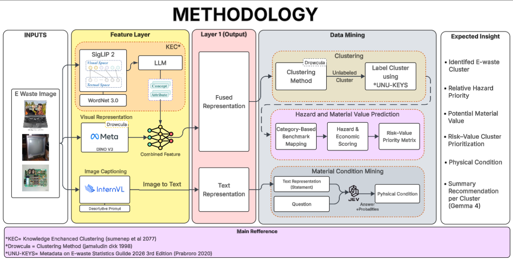

# DROWCULA-MODELLING — Unsupervised E-Waste Image Clustering

Pengelompokan 3.961 citra e-waste tanpa label menjadi **17 cluster** memakai
fusi **DINOv3 + KEC** dalam kerangka **DROWCULA** (UMAP + pencarian-K + K-Means),
dilanjut grounding ke taksonomi UNU-KEYs-v.2 dan pemetaan nilai-bahaya (EVI/HI).

## Hasil utama

- **K=17**, silhouette **0,6828**, Davies-Bouldin **0,4370** — tanpa label pelatihan.
- Voting SigLIP2 sepakat dengan label akhir pada **15 dari 17** cluster; 2 sisanya
  keputusan inspeksi manusia.
- 17 cluster → 10 kode UNU-KEYs-v.2 + 4 aliran GAP (baterai, PCB, scrap, outlet).
- Kuadran nilai-bahaya: Q1×8, Q2×1 (CRT), Q3×2, Q4×6.

Angka lengkap: [`docs/RESULTS_SUMMARY.md`](docs/RESULTS_SUMMARY.md) ·
Bukti run + sha256: [`docs/RUN_EVIDENCE.md`](docs/RUN_EVIDENCE.md)

## Metodologi



Input awal adalah citra e-waste dari babak penyisihan (subset `1_Electronic`,
3.961 citra). Tahap lanjutan setelah clustering memperoleh **kondisi barang**
(data mining condition): caption per citra → klasifikasi kondisi fisik →
rekomendasi penanganan per cluster, dijalankan lewat notebook
`code/notebook/05-07` (lihat [`code/notebook/README.md`](code/notebook/README.md)).

## Implementasi

Satu skrip = satu tujuan, dijalankan berurutan dari repo root:

| Skrip | Kerja singkat |
| --- | --- |
| `00_prepare_embeddings.py` | Folder citra → manifest + embedding DINOv3 |
| `01_dinov3_kmeans_baseline.py` | Baseline K-Means murni, K=5..25 |
| `02_drowcula_dinov3.py` | DROWCULA resep resmi di DINOv3-only |
| `03_kec_drowcula_dinov3.py` | KEC + fusi 1536-D + DROWCULA (metode usulan) |
| `04_evaluate_clustering_spaces.py` | Evaluasi post-hoc antar label |
| `05_kec_drowcula_cluster_figures.py` | Grid top-9/far-9 per cluster |
| `06_unukey_grounding_siglip2.py` | Voting zero-shot → nama produk per cluster |
| `07_cluster_risk_value_mapping.py` | EVI/HI + kuadran keputusan |
| `08_cluster_insight_figures.py` | Figur insight untuk naskah |
| `run_full_pipeline.py` | Folder citra → hasil dalam satu perintah |

Notebook [`03_modeling_full_locked.ipynb`](code/notebook/03_modeling_full_locked.ipynb)
dan [`04_labeling_insight_locked.ipynb`](code/notebook/04_labeling_insight_locked.ipynb)
adalah versi locked dari pipeline di atas dengan output tersimpan — bisa dibaca
tanpa run ulang.

Lanjutan pipeline: alur mendapatkan kondisi barang (data mining condition),
di `code/notebook/05-07`:

| Notebook | Kerja singkat | Input | Output |
| --- | --- | --- | --- |
| [`05_caption_internvl3_runpod.ipynb`](code/notebook/05_caption_internvl3_runpod.ipynb) | Captioning InternVL3-8B di RunPod RTX 4090 | citra train | `captions.csv` per citra |
| [`06_condition_jev_api.ipynb`](code/notebook/06_condition_jev_api.ipynb) | Klasifikasi kondisi fisik (Intact / Disassembled / Damaged) via API | `captions.csv` | `results.csv`, `summary.csv`, interpretasi |
| [`07_recommendation_qwen38.ipynb`](code/notebook/07_recommendation_qwen38.ipynb) | Rekomendasi penanganan per cluster (≤80 kata) | kondisi + `cluster_risk_value.csv` | `recommendations.csv` |

Alurnya berurutan: 05 → 06 → 07; kredensial API diminta via `getpass` saat
run, tidak tersimpan di file.

Detail tiap skrip: [`code/scripts/README.md`](code/scripts/README.md).

## Setup

```bash
python3.12 --version                                          # 3.12, tanpa virtual env
python3.12 -m pip install --user -r requirements.txt          # dependensi
python3.12 -c "import nltk; nltk.download('wordnet')"         # untuk regenerasi KEC
```

Model DINOv3 dan SigLIP2 terunduh otomatis dari Hugging Face Hub saat run
pertama (publik, tanpa token).

### Environment / API key

| Kapan | Yang dibutuhkan |
| --- | --- |
| Rerun 01, 02, 04–08 (offline, artefak disertakan di repo) | **Tidak butuh key apa pun** |
| Regenerasi KEC (`03`; cache KEC ±190 MB tidak disertakan) | `OPENAI_API_KEY` (GPT-4o) + WordNet + GPU SigLIP2 |
| Notebook 06–07 (kondisi & rekomendasi) | `BAI_API_KEY` — diminta via `getpass` saat run, tidak lewat `.env` |
| Notebook 05 (captioning) | Tanpa key; butuh instance RunPod RTX 4090 |

Cara set kunci untuk skrip (`03` membaca env dulu, fallback parse `.env`):

```bash
cp .env.example .env    # lalu isi OPENAI_API_KEY=sk-...
# atau
export OPENAI_API_KEY=sk-...
```

`.env` tidak pernah di-commit (sudah di `.gitignore`).

## Cara pakai

Dari clone baru, **seluruh hasil final sudah tersedia di repo** — label produk,
metrik, dan figur ada di `data/processed/electronic/`, dan notebook 03–04
memuat output tersimpan. Tidak perlu menjalankan apa pun untuk memeriksa hasil.

Menjalankan ulang tahap analisis (berurutan, dari repo root, tanpa kunci API):

```bash
python3.12 code/scripts/01_dinov3_kmeans_baseline.py    # offline
python3.12 code/scripts/02_drowcula_dinov3.py           # offline
python3.12 code/scripts/04_evaluate_clustering_spaces.py # offline
python3.12 code/scripts/06_unukey_grounding_siglip2.py  # offline (embedding SigLIP2 disertakan)
python3.12 code/scripts/07_cluster_risk_value_mapping.py # offline
python3.12 code/scripts/08_cluster_insight_figures.py   # offline
```

Dua tahap punya kebutuhan khusus:

- `03_kec_drowcula_dinov3.py` — tahap pengetahuan KEC memakai GPT-4o. Cache
  KEC lengkap (±190 MB) tidak disertakan di repo, jadi skrip akan meregenerasi
  dan membutuhkan `OPENAI_API_KEY` + korpus WordNet (+ GPU untuk SigLIP2).
  Setelah fusi terbentuk, UMAP → pencarian-K → K-Means berjalan deterministik
  (seed 42).
- `05_kec_drowcula_cluster_figures.py` — membutuhkan citra asli dataset
  penyisihan (±1,1 GB, tidak disertakan). Letakkan sesuai path di
  `data/processed/electronic/embedding_ids.csv`, atau jalankan dengan dataset
  Anda sendiri.

```bash
# Dataset citra baru → hasil di folder output pilihanmu
python3.12 code/scripts/run_full_pipeline.py \
  --input-dir <folder_citra> --workdir <folder_output>
# varian: --mode full | --k-min 2 --k-max 25 | --stages 00,02 | --dry-run
```

`run_full_pipeline.py` membangun semuanya dari nol untuk dataset tersebut
(embedding lewat `00`, tanpa kunci API pada mode default). Setiap tahap
menulis hasilnya ke foldernya sendiri di bawah `--workdir`, lengkap dengan
metrik dan figur. Label akhir per cluster divalidasi manusia
(`final_cluster_labels.csv`) sebelum masuk tahap pemetaan nilai-bahaya.

## Struktur

```text
code/
  scripts/       # pipeline final 00–08 + run_full_pipeline.py
  notebook/      # core locked 03–04 + kondisi barang 05–07
data/
  raw/           # data mentah (tidak disertakan; subset 1_Electronic dari penyisihan)
  processed/     # embedding, label, metrik, figures
docs/
requirements.txt
```

## Hasil run (ter-commit di repo)

Semua output run final tersimpan di repo, bukan hanya kodenya:

| File | Isi |
| --- | --- |
| `data/processed/electronic/kec_drowcula_dinov3/final_cluster_labels.csv` | 17 cluster + label produk terverifikasi manusia + status voting |
| `data/processed/electronic/kec_drowcula_dinov3/cluster_risk_value.csv` | EVI/HI + kuadran per cluster |
| `data/processed/electronic/kec_drowcula_dinov3/cluster_grounding.csv/.json` | Voting SigLIP2 per cluster (bukti grounding) |
| `data/processed/electronic/kec_drowcula_dinov3/final_metrics.json` | K=17, silhouette 0,6828, DB 0,4370 |
| `data/processed/electronic/kec_drowcula_dinov3/k_search_scores.csv` | Skor silhouette/DBI K=2..25 (bukti pemilihan K) |
| `data/processed/electronic/kec_drowcula_dinov3/figures/` | 48 figur: grid verifikasi per cluster, UMAP 3-D, matriks risk-value, insight |
| `data/processed/electronic/drowcula_dinov3/` | Baseline DINOv3-only (pembanding ablasi) |
| `data/processed/electronic/equivalent_space_evaluation/` | Evaluasi post-hoc antar label |

Sidik sha256 tiap file kunci + cara verifikasi ulang:
[`docs/RUN_EVIDENCE.md`](docs/RUN_EVIDENCE.md).
