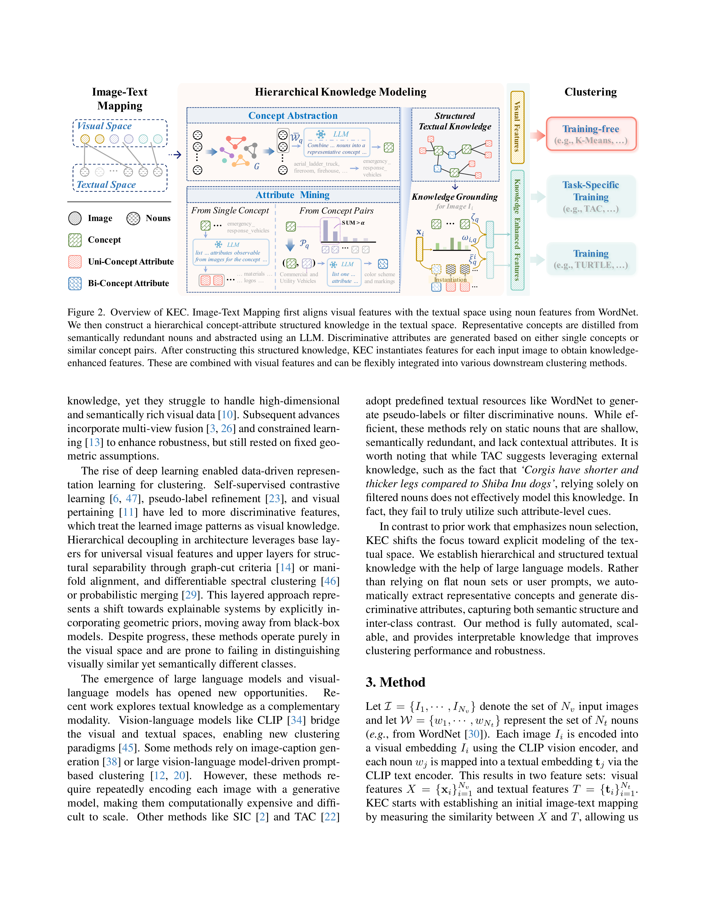
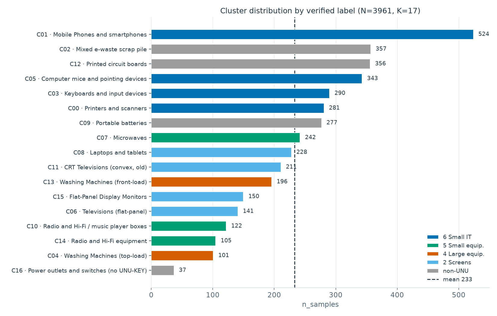
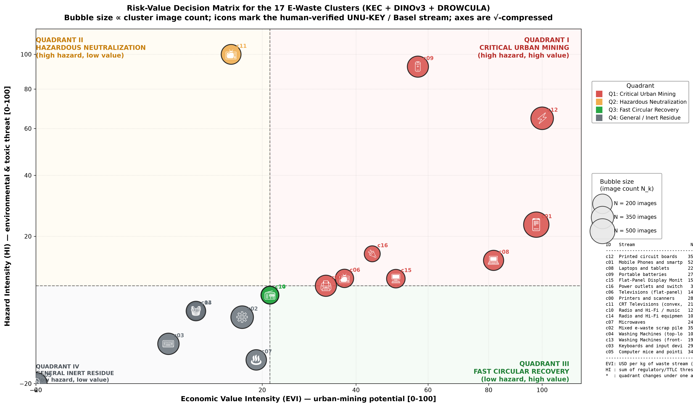

# JUDUL KARYA JUDUL KARYA JUDUL KARYA

## SUB JUDUL KARYA (JIKA DIPERLUKAN)

## Abstrak

Limbah elektronik tumbuh lebih cepat daripada daur ulang resminya, sementara pemilahan manual berisiko tinggi dan data lapangan umumnya tidak memiliki label. Penelitian ini mengusulkan kerangka pengelompokan citra e-waste secara unsupervised yang menggabungkan representasi visual DINOv3 dengan fitur berpengetahuan KEC, mengelompokkannya melalui resam open-world DROWCULA dengan pencarian jumlah cluster otomatis, lalu menafsirkan hasilnya ke taksonomi UNU-KEYs-v.2 serta memetakan estimasi nilai ekonomi (EVI) dan bahaya (HI) berbasis ambang regulasi internasional. Pada 3.961 citra, kerangka ini menemukan 17 cluster dengan silhouette 0,6828 dan Davies-Bouldin 0,4370 tanpa label pelatihan. Validasi dua lapis menunjukkan voting SigLIP2 sepakat dengan label akhir pada 15 dari 17 cluster, sementara inspeksi manusia menentukan sisanya. Hasilnya mencakup empat belahan kode yang bermakna serta empat aliran celah-cakupan seperti baterai dan papan sirkuit yang tidak tercakup taksonomi produk. Estimasi nilai-bahaya memposisikan papan sirkuit dan smartphone sebagai kandidat urban mining bernilai hingga 64,63 USD per kg, CRT televisi sebagai bahaya ekstrem yang disarankan dinetralisasi, dan baterai sebagai prioritas yang bernilai sekaligus berbahaya. Klasifikasi kondisi fisik memperkirakan 69,4% objek masih utuh sehingga berpeluang direfurbish. Kerangka ini memperlihatkan bahwa timbulan e-waste tanpa label berpotensi diubah menjadi peta estimasi prioritas pengelolaan yang terarah, dengan seluruh angka sebagai estimasi berbasis komposisi tipikal kategori yang perlu diverifikasi pada konteks lapangan.

**Kata kunci:** limbah elektronik, unsupervised clustering, KEC, DROWCULA, pemetaan nilai-bahaya

---

## 1. PENDAHULUAN

### 1.1 Latar Belakang

Sampah elektronik (*electronic waste* atau e-waste) merupakan salah satu aliran limbah padat dengan pertumbuhan tercepat di dunia. Timbulan global mencapai 62 juta ton pada 2022 dan diproyeksikan menjadi 82 juta ton pada 2030, namun hanya 22,3% yang terdokumentasi terkumpul dan terdaur ulang secara layak (Baldé et al., 2024). Pengelolaan yang tidak tepat dapat melepaskan zat berbahaya seperti timbal dan merkuri, sementara praktik pembongkaran tidak aman, pembakaran terbuka, dan pengolahan informal meningkatkan risiko kesehatan, terutama bagi anak-anak dan ibu hamil (World Health Organization, 2024).

Di sisi lain, e-waste juga mengandung sumber daya material bernilai ekonomi. Timbulan tahun 2022 diperkirakan memuat sekitar 31 juta ton logam bernilai USD 91 miliar, termasuk tembaga, emas, dan besi, namun hanya sebagian yang berhasil dipulihkan melalui sistem pengumpulan dan daur ulang formal (Baldé et al., 2024). Peningkatan efektivitas pengelolaan karena itu sekaligus mengurangi dampak lingkungan dan memulihkan material yang masih bernilai.

Keragaman perangkat, komponen, dan kondisi fisik menjadikan karakterisasi serta pengelompokan penting untuk memahami perbedaan karakteristik antar kelompok limbah. Park et al. (2020), misalnya, mengelompokkan produk WEEE melalui cluster analysis berbasis karakteristik fisik, operasional, biaya, dan nilai material, sementara pendekatan computer vision pada e-waste lebih banyak dimanfaatkan untuk klasifikasi dan identifikasi komponen, dengan pendekatan deep learning tersendiri pada masing-masing tugas (Soomro et al., 2022, Sharma &amp; Kumar, 2024, dan Sarswat et al., 2024).

#### Kesenjangan Penelitian

Berdasarkan penelitian yang ditinjau, pendekatan berbasis atribut maupun computer vision pada e-waste umumnya bersifat terawasi dan belum menjadikan pembentukan kelompok dari karakteristik visual secara unsupervised, tanpa menetapkan kelas produk sebelumnya, sebagai fokus utama. Untuk mendukung pengelompokan dalam kondisi tersebut, diperlukan representasi yang tidak hanya menangkap kemiripan visual tetapi juga membedakan informasi semantik yang relevan. KEC memperkaya representasi visual dengan pengetahuan tekstual terstruktur (Zhong et al., 2026), sedangkan DROWCULA dirancang untuk unsupervised clustering open-world ketika jumlah kelompok belum diketahui (Ozbey &amp; Diochnos, 2025). Setelah kelompok terbentuk, identitas produk diberikan menggunakan UNU-KEYs-v.2 sebagai kerangka referensi pasca-clustering (Lysaght et al., 2026). Dengan demikian, penelitian ini menggabungkan pengelompokan visual-semantik secara unsupervised, identifikasi produk setelah clustering, serta karakterisasi ekonomi dan lingkungan terhadap kelompok yang terbentuk.

### 1.2 Rumusan Masalah

1. Bagaimana citra sampah elektronik dapat dikelompokkan berdasarkan kemiripan karakteristik visual secara unsupervised untuk merepresentasikan keragaman e-waste tanpa bergantung pada label yang telah ditentukan sebelumnya?
2. Bagaimana karakteristik ekonomi dan lingkungan dari setiap kelompok sampah elektronik yang terbentuk serta bagaimana posisi masing-masing kelompok pada kedua dimensi tersebut?
3. Bagaimana hasil pengelompokan dan analisis ekonomi-lingkungan tersebut dapat digunakan untuk menentukan prioritas serta menyusun rekomendasi pengelolaan sampah elektronik?

### 1.3 Tujuan

1. Mengelompokkan citra sampah elektronik secara unsupervised berdasarkan kemiripan karakteristik visual untuk merepresentasikan keragaman e-waste tanpa menggunakan label yang telah ditentukan sebelumnya.
2. Menganalisis karakteristik ekonomi dan lingkungan dari setiap kelompok yang terbentuk serta memetakan posisi masing-masing kelompok berdasarkan kedua dimensi tersebut.
3. Menentukan prioritas dan menyusun rekomendasi pengelolaan sampah elektronik berdasarkan hasil pengelompokan dan analisis ekonomi-lingkungan.

### 1.4 Manfaat

Penelitian ini diharapkan dapat memberikan pemetaan sampah elektronik berdasarkan kemiripan visual serta gambaran karakteristik ekonomi dan lingkungan dari setiap kelompok yang terbentuk. Hasil tersebut dapat digunakan sebagai dasar untuk mengidentifikasi kelompok dengan karakteristik dan prioritas pengelolaan yang berbeda serta menyusun rekomendasi penanganan e-waste yang lebih terarah.

Secara akademis, penelitian ini memberikan referensi penerapan pendekatan unsupervised image clustering yang mengombinasikan DROWCULA dan KEC pada citra sampah elektronik, serta pemanfaatan hasil pengelompokan untuk menganalisis karakteristik ekonomi dan lingkungan sebagai dasar interpretasi dan penentuan prioritas pengelolaan e-waste.

### 1.5 Kontribusi

> TODO: Tulis kontribusi — saat ini masih `NYUSUL`.

---

## 2. METODOLOGI

### 2.1 Alur Penelitian

Penelitian ini mengikuti alur empat tahap di atas 3.961 citra e-waste tanpa label. Pertama, setiap citra direpresentasikan oleh fitur visual DINOv3 dan fitur berpengetahuan KEC yang digabung menjadi satu vektor. Kedua, representasi gabungan tersebut dikelompokkan dengan DROWCULA, yang memilih jumlah cluster terbaik secara otomatis. Ketiga, tiap cluster diberi identitas produk melalui voting SigLIP2 yang divalidasi inspeksi manusia, kemudian dipetakan menjadi estimasi nilai ekonomi (EVI) dan bahaya (HI) berbasis pedoman e-waste internasional. Keempat, kondisi fisik tiap objek dianalisis dari keterangan gambarnya, dan seluruh hasil dirangkum menjadi rekomendasi penanganan per cluster. Alur lengkapnya disajikan pada Gambar 1.

<!-- Gambar 1 (alur penelitian) menyusul; lihat docs/figures/metodologi_pipeline.png -->

### 2.2 Dataset

Dataset yang digunakan terdiri atas 3.961 citra yang merepresentasikan objek dan kondisi visual yang berkaitan dengan limbah elektronik. Citra menunjukkan keragaman bentuk dan jenis perangkat maupun komponen elektronik, termasuk citra yang memuat satu maupun beberapa objek dalam satu tampilan. Keragaman tersebut dipertahankan karena tujuan analisis adalah menemukan kelompok visual yang terbentuk secara alami tanpa menetapkan kelas objek terlebih dahulu.

Data tersebut menjadi masukan utama untuk pembentukan representasi visual dan representasi berbasis pengetahuan pada tahapan berikutnya. Karakteristik citra yang heterogen memungkinkan proses pengelompokan mempertimbangkan kemiripan visual sekaligus informasi semantik yang berkaitan dengan perangkat dan material elektronik.

### 2.3 E-Waste Statistics Guideline

E-waste Statistics: Guidelines on Classifications, Reporting and Indicators edisi ketiga menjadi rujukan terminologi dan kategori produk pada penelitian ini. Pedoman tersebut menyediakan kerangka pengukuran dan pelaporan e-waste terstandar, dengan UNU-KEYs-v.2 sebagai sistem pengelompokan produk yang mencakup 57 kategori berdasarkan karakteristik yang relevan seperti jenis produk, masa pakai, berat rata-rata, dan komposisi material (Lysaght et al., 2026).

Dalam penelitian ini, UNU-KEYs-v.2 tidak digunakan sebagai kelas yang ditentukan sebelum clustering, melainkan diterapkan setelah cluster terbentuk untuk memberikan identitas produk pada hasil pengelompokan visual.

### 2.4 Knowledge-Enhanced Unsupervised Clustering

#### 2.4.1 KEC (Knowledge-Enhanced Clustering)

Citra e-waste sering terlihat mirip secara visual tetapi berbeda secara semantik, misalnya monitor flat-panel dengan TV flat-panel atau keyboard dengan mouse yang sama-sama perangkat small IT. Representasi visual saja mudah mencampuradukkan kasus seperti ini. KEC (Knowledge-Enhanced Clustering) mengatasinya dengan menyuntikkan pengetahuan tekstual terstruktur ke dalam fitur visual (Zhong et al., 2026). Kosakata tekstual yang redundan diringkas menjadi segelintir konsep padat, LLM menggali atribut pembeda tiap konsep secara hierarkis, lalu pengetahuan tersebut disuntikkan kembali ke setiap citra sebagai fitur berpengetahuan.

Penelitian ini mengikuti jalur training-free paper acuan dengan penyesuaian pada penyelaras citra-teks. SigLIP2 dipakai menggantikan CLIP ViT-B/32 karena dilaporkan mengungguli CLIP pada zero-shot classification dan image-text retrieval (Tschannen et al., 2025). GPT-4o merumuskan konsep beserta atributnya, dengan bobot visual $\alpha = 0{,}8$, ambang penggabungan $\beta = 0{,}8$, dua atribut uni-konsep per konsep, dan satu atribut bi-konsep per pasangan konsep mirip. Fitur berpengetahuan hasil grounding dinormalisasi L2 lalu digabung dengan fitur visual DINOv3 menjadi representasi 1.536-D. Alur lengkapnya disajikan pada Gambar 2.

Pada benchmark 20 dataset pada paper acuannya, struktur hierarkis KEC konsisten memperbaiki hasil clustering dibanding penggunaan teks mentah. Integrasi KEC+DROWCULA pada penelitian ini merupakan kombinasi baru yang tidak diusulkan di kedua paper acuan.

#### 2.4.2 Adaptasi DROWCULA

DROWCULA (Dimensionally Reduced Open-World Clustering) adalah resep clustering sepenuhnya unsupervised untuk kondisi open-world ketika jumlah kelompok tidak diketahui sebelumnya (Ozbey dan Diochnos, 2025). Resepnya terdiri atas empat langkah, yaitu embedding Vision Transformer, normalisasi L2, reduksi dimensi dengan manifold learning, lalu K-Means. Jumlah cluster dipilih dari silhouette tertinggi pada pencarian K = 2 sampai 25 seperti pada persamaan (2).

$$
\hat{K} = \arg\max_{K \in [2,\,25]}\, \text{Silhouette}(\text{UMAP}(\text{Normalize}(F)),\, \text{KMeans}_K) \tag{2}
$$

Kunci resep ini adalah reduksi non-linear sebelum clustering. Jarak pada ruang berdimensi tinggi sering kurang sejalan dengan struktur semantik objek, sedangkan UMAP mempertahankan geometri lokal manifold sehingga batas antar-cluster lebih tajam. Paper acuan juga menunjukkan reduksi ini menaikkan korelasi silhouette-akurasi dari r = 0,86 menjadi r = 0,99 pada CIFAR-10 (Ozbey dan Diochnos, 2025, Figure 4). Pada penelitian ini, backbone visual DINOv2 diganti DINOv3 ViT-B/16 dan input UMAP adalah representasi fusi DINOv3+KEC 1.536-D (Subbab 2.4.1). Parameter pelaksanaan mengikuti Algorithm 1 paper acuan, dengan UMAP tiga komponen, sepuluh tetangga, min\_dist 0,1, seed 42, serta K-Means dengan n\_init 200 dan max\_iter 10000.

#### 2.4.3 Grounding Cluster ke Taksonomi UNU-KEYs-v.2

UNU-KEYs dipakai murni sebagai penerjemah setelah cluster dibekukan, yaitu tidak pernah menyentuh pembentukan fitur, pemilihan $K$, maupun clustering, sehingga tidak ada kebocoran label.

Penamaan memakai voting zero-shot SigLIP2  terhadap 57 kategori UNU-KEYs plus 3 kategori celah-cakupan (GAP-BATT, GAP-PCB, GAP-SCRAP) dengan ensemble tiga template prompt. Setiap kategori diwakili nama kanonik satu konsep (misalnya washing machine untuk 0104) sebagai isian prompt agar konsep yang dibandingkan dengan citra tidak kabur. Setiap citra diberi pemenang kosinus tertinggi seperti pada persamaan (3), lalu suara diagregasi per cluster menjadi proporsi seperti pada persamaan (4), dengan cluster campuran dilaporkan multi-kandidat tanpa dipaksakan satu nama. Kategori GAP menang bila mengungguli UNU-KEY terbaik lebih dari 0,005 kosinus.

$$
\hat{y}_i = \arg\max_u\, \cos(x_i, t_u) \tag{3}
$$

$$
\text{share}(u, C) = \frac{|\{i \in C : \hat{y}_i = u\}|}{|C|} \tag{4}
$$

Kata final ditentukan manusia lewat inspeksi visual grid citra terdekat dan terjauh dari centroid. Keputusan manusia menjadi penentu akhir atas hasil voting otomatis.

#### 2.4.4 Kuantifikasi Hazard dan Material Value

Pedoman UNITAR/UNEP menyediakan dua parameter empiris utama yang menjadi dasar kuantifikasi ini (Lysaght et al., 2026). Pertama, Tabel 25 menyajikan berat rata-rata per unit untuk setiap kode UNU-KEYs (menggunakan baseline 2024, misalnya mesin cuci 0104 sebesar 74,36 kg dan smartphone 0306 sebesar 0,08 kg) sehingga estimasi jumlah unit dapat dikonversi menjadi estimasi massa total. Kedua, Tabel 26 menyajikan kandungan material rata-rata dalam mg unsur per kg limbah yang dipetakan ke dalam enam kategori EU-6PV berdasarkan konsolidasi data material FutuRaM (Kippert et al., 2025) dan pedoman UNITAR/UNEP (Lysaght et al., 2026), mencakup logam dasar (Fe, Al, Cu, Ni), logam berharga/kritis (Au, Ag, Pd, Co), serta unsur toksik (Pb, Hg). Kedua parameter inilah yang menghubungkan hasil pengelompokan visual berbasis UNU-KEYs dengan karakteristik material dan potensi bahaya tiap kelompok.

##### 2.4.4.1 Hazard Intensity (HI)

Hazard Intensity (HI) mengukur tingkat ancaman toksisitas ekologis dan kesehatan melalui jumlah kuota kandungan bahaya terhadap ambang batas regulasi internasional seperti pada persamaan (5). Normalisasi ambangnya meliputi Hg/15 mengikuti ambang limbah merkuri Konvensi Minamata (COP-5, keputusan MC-5/10), Pb/1000 mengikuti batas RoHS Annex II (1.000 mg/kg), POPs/1000 merupakan normalisasi usulan dengan konten Low-POP Basel Convention (50 mg/kg untuk PBDE) dan pemetaan fraksi polimer Annex 8 pedoman UNITAR/UNEP (Lysaght et al., 2026) sebagai titik referensi, serta Co/8000 dan Ni/2000 mengikuti ambang konsentrasi toksisitas TTLC (Total Threshold Limit Concentration) berdasarkan California Code of Regulations Title 22  66261.24 sebagaimana diterapkan pada studi karakterisasi limbah baterai dan e-waste (Kang et al., 2013) serta kajian pengelolaannya (Nnorom &amp; Osibanjo, 2009). Untuk aliran baterai dan papan sirkuit, konsentrasi Co dan Ni diperkaya oleh data empiris elektroda baterai bekas dari kedua studi tersebut.

$$
\text{HI} = \frac{c_{\text{Hg}}}{15} + \frac{c_{\text{Pb}}}{1000} + \frac{c_{\text{POPs}}}{1000} + \frac{c_{\text{Co}}}{8000} + \frac{c_{\text{Ni}}}{2000} \tag{5}
$$

##### 2.4.4.2 Economic Value Intensity (EVI)

Economic Value Intensity (EVI) menghitung potensi urban mining dalam USD per kg limbah dengan menjumlahkan kandungan tujuh logam dikali harga pasar masing-masing per miligram seperti pada persamaan (6).

$$
\text{EVI} = \sum_{m \in \{\text{Au},\text{Ag},\text{Pd},\text{Cu},\text{Co},\text{Al},\text{Fe}\}} c_m \cdot p_m \tag{6}
$$

Karena rentang nilai kedua indeks sangat lebar, keduanya distandardisasi min–max ke skala 0–100 pada skala logaritmik seperti pada persamaan (7). Batas kuadran tiap sumbu tidak ditetapkan manual, melainkan diambil dari median skor seluruh cluster, sehingga ambang mengikuti distribusi data itu sendiri. Cluster di atas median masuk wilayah tinggi dan di bawahnya wilayah rendah pada masing-masing sumbu. Posisi strategis tiap cluster kemudian ditentukan kuadran pada perpotongan kedua wilayah tersebut, yaitu Q1 Critical Urban Mining, Q2 Hazardous Neutralization, Q3 Fast Circular Recovery, dan Q4 General Residue.

$$
s = 100 \cdot \frac{\log_{10}(x+1) - \min(\log_{10}(x+1))}{\max(\log_{10}(x+1)) - \min(\log_{10}(x+1))}, \quad x \in \{\text{EVI},\ \text{HI}\} \tag{7}
$$

### 2.5 Material Condition Mining

#### 2.5.1 Image Captioning Menggunakan InternVL3.5

Image captioning adalah proses menghasilkan deskripsi tekstual dari sebuah gambar, yang dalam alur kerja ini bertujuan untuk menangkap informasi deskriptif mengenai kondisi fisik, bentuk, serta karakteristik visual tiap objek e-waste. Model yang digunakan adalah InternVL3.5 (Chen et al., 2025), sebuah model Vision-Language dari Shanghai AI Laboratory yang mengandalkan kemampuan Dynamic High Resolution untuk memproses gambar secara adaptif dengan membagi citra menjadi beberapa tile dinamis sesuai rasio aspek input, sehingga detail visual halus seperti komponen rusak maupun kondisi fisik permukaan objek e-waste dapat ditangkap secara lebih presisi.

#### 2.5.2 Klasifikasi Kondisi Material Menggunakan Jev

Klasifikasi kondisi material dilakukan untuk menentukan kondisi fisik objek *e-waste* secara otomatis berdasarkan representasi teks (*statement*) dari tahap *image captioning* yang dikombinasikan dengan pertanyaan (*question*) terarah mengenai aspek kondisi material. Proses ini memanfaatkan model JEV (Almeida, 2026), sebuah *System One Model* terbaru dari TypeSafe AI yang memperkenalkan metode pelatihan *Reinforcement Learning for Calibrated Decisions* (RLCD), berbeda secara fundamental dari pendekatan RLHF maupun RLVR pada LLM konvensional. Keunggulan utama JEV terletak pada kemampuannya menghasilkan *type-safe structured values* beserta probabilitas dan *confidence score* secara paralel dalam satu kueri tanpa risiko halusinasi, menjadikannya lebih unggul dibandingkan model LLM terkemuka seperti GPT-6 Astra maupun Fable 5.1 untuk tugas klasifikasi secara langsung, akurat, dan efisien.

### 2.6 Action Recommendation

#### 2.6.1 Rekomendasi dan Saran Menggunakan  **Qwen 3.8**

Hasil pengelompokan kemudian dirangkum pada tingkat cluster untuk menghasilkan gambaran tindakan pengelolaan yang mempertimbangkan kategori produk, kondisi fisik, karakteristik ekonomi-lingkungan, serta ketidakpastian hasil identifikasi. Model yang digunakan untuk tahap rekomendasi dan saran per *cluster* dalam penelitian ini adalah **Qwen3.8-27B** (Qwen Team, 2026), sebuah *Large Language Model* (LLM) berskala 27 miliar parameter yang dikembangkan oleh Alibaba Cloud di atas fondasi arsitektur Qwen3.5, dengan kemampuan *flexible thinking control* untuk mengatur kedalaman penalaran secara adaptif. Dalam penelitian ini, model digunakan untuk menghasilkan ringkasan deskriptif beserta rekomendasi penanganan yang spesifik untuk setiap *cluster e-waste* berdasarkan hasil analisis kondisi material, nilai hazard, dan nilai ekonomi yang telah diperoleh dari tahap sebelumnya. Model ini dipilih karena performanya yang unggul pada berbagai *benchmark*, di mana Qwen3.8-27B berhasil melampaui model-model komersial terkemuka seperti Opus 4.6 Max dari Anthropic dan Muse Glimmer-30B pada sejumlah tugas *agentic* dan *instruction following*, yang bisa dilihat pada Tabel 1. 

**Tabel 1.** Benchmark Qwen3.8

|                                            |                 |                 |                  |                      |                 |
| ------------------------------------------ | --------------- | --------------- | ---------------- | -------------------- | --------------- |
|                                            | **Qwen3.8-27B** | **Qwen3.6-27B** | **Qwen3.7-Plus** | **Muse Glimmer-30B** | **Opus4.6 Max** |
| **Instruction following** IFBench       | **79,5**        | 69,1            | 79,1             | 77,0                 | 62,5            |
| **Scientific reasoning** GPQA Diamond   | 89,2            | 87,8            | 90,3             | 83,5                 | **91,3**        |
| **Multidisciplinary reasoning** HLE     | 30,8            | 24,0            | 34,7             | 22,0                 | **40,0**        |
| **Competitive coding** LiveCodeBench v6 | **90,3**        | 83,9            | 89,6             | -                    | 88,8            |

---

## 3. HASIL DAN PEMBAHASAN

### 3.1 Pemilihan K dan Kualitas Cluster

Prosedur DROWCULA yang identik (resep UMAP, rentang K=2 sampai 25, seed 42) dijalankan pada dua representasi atas 3.961 citra, yaitu DINOv3 768-D dan fusi DINOv3+KEC 1.536-D. Keduanya secara independen memilih $\hat{K}=17$, sehingga perbandingan pada K yang sama adil dari sisi jumlah cluster. Pada varian fusi, silhouette mencapai 0,6828 bertepatan dengan minimum Davies-Bouldin (0,4370). K=16 memberi 0,6801 dan K=18 turun ke 0,6682, sehingga puncak pada K=17 jelas dan disepakati kedua indeks (Gambar 4). Ukuran cluster terentang dari 37 citra (stopkontak dan sakelar) hingga 524 citra (smartphone).

Tabel 1 menguji kontribusi KEC dalam kerangka DROWCULA yang sama, yaitu baseline DINOv3 dibandingkan fusi DINOv3+KEC. Fusi memperbaiki silhouette sebesar +0,0042 dan menurunkan DBI sebesar 0,0022. Indeks Calinski-Harabasz justru sedikit turun sehingga klaim perbaikan dibatasi pada silhouette dan DBI sebagai diagnostik internal, bukan akurasi klasifikasi.

Tabel 1. Ablasi representasi dalam kerangka DROWCULA yang sama (K=17).

| Metode                | Silhouette | DBI     | CHI      | Inertia |
| --------------------- | ----------: | -------: | --------: | -------: |
| DROWCULA (DINOv3)     | 0,6786     | 0,4392  | 15.648,2 | 2.816,5 |
| DROWCULA (DINOv3+KEC) | 0,6828     | 0,4370  | 15.591,7 | 2.757,9 |
| Selisih               | +0,0042    | -0,0022 | -56,5    | -58,6   |

### 3.2 Struktur Cluster dan Pemetaan UNU-KEYs

Sebanyak 17 cluster visual memetakan ke 10 kode UNU-KEYs-v.2 plus 4 aliran GAP yang bukan produk jadi (baterai, papan sirkuit, scrap campuran, stopkontak) namun diakui pedoman sebagai aliran Basel/HS. Penamaan divalidasi dua lapis. Voting zero-shot SigLIP2 per citra sepakat dengan label akhir pada 15 dari 17 cluster (proporsi suara 55 sampai 96%), sementara inspeksi manusia menentukan dua cluster sisanya, yaitu pasangan kembar visual 0403/0404 dan stopkontak tanpa kandidat taksonomi (GAP-OTHER), sekaligus memperhalus sub-tipe dalam satu kode. Rincian tiap cluster disajikan pada Tabel 2.

Tabel 2. Validasi dua lapis berupa voting SigLIP2 per citra dan keputusan inspeksi manusia. Proporsi adalah persentase citra yang memilih kode pemenang. Catatan pada kolom Human menunjukkan penyempurnaan sub-tipe.

| C   | Final label (code)                          | SigLIP2 vote    | Proporsi | Human                            |
| ---: | ------------------------------------------- | --------------- | --------: | -------------------------------- |
| 00  | Printers and scanners (0304)                | 0304            | 92%      | Konfirmasi                       |
| 01  | Mobile phones and smartphones (0306)        | 0306            | 89%      | Konfirmasi                       |
| 02  | Mixed e-waste scrap pile (GAP-SCRAP)        | GAP-SCRAP       | 67%      | Konfirmasi                       |
| 03  | Keyboards and input devices (0301)          | 0301            | 96%      | Konfirmasi (keyboard)            |
| 04  | Washing machines top-load (0104)            | 0104            | 78%      | Konfirmasi (top-load)            |
| 05  | Computer mice and pointing devices (0301)   | 0301            | 65%      | Konfirmasi (mouse)               |
| 06  | Televisions flat-panel (0408)               | 0408            | 82%      | Konfirmasi                       |
| 07  | Microwaves (0114)                           | 0114            | 89%      | Konfirmasi                       |
| 08  | Laptops and tablets (0303)                  | 0303            | 85%      | Konfirmasi                       |
| 09  | Portable batteries (GAP-BATT)               | GAP-BATT        | 76%      | Konfirmasi                       |
| 10  | Radio and Hi-Fi / music player boxes (0403) | 0404/0403/0405? | 41%      | Koreksi (0404 → 0403)            |
| 11  | CRT televisions convex (0407)               | 0407            | 74%      | Konfirmasi                       |
| 12  | Printed circuit boards (GAP-PCB)            | GAP-PCB         | 67%      | Konfirmasi                       |
| 13  | Washing machines front-load (0104)          | 0104            | 81%      | Konfirmasi (front-load)          |
| 14  | Radio and Hi-Fi equipment (0403)            | 0403/0402/0404? | 48%      | Konfirmasi (radio/hi-fi)         |
| 15  | Flat-panel display monitors (0309)          | 0309            | 55%      | Konfirmasi                       |
| 16  | Power outlets and switches (GAP-OTHER)      | 0901/0701/0202? | 24%      | Koreksi (tanpa kandidat UNU-KEY) |

Distribusi ukuran tiap cluster disajikan pada Gambar 5, dengan perangkat IT kecil di puncak (smartphone 524, mouse 343), empat aliran GAP berukuran menengah, dan stopkontak (37) sebagai cluster terkecil.

Struktur ruang fitur pada Gambar 6 memperlihatkan dua bukti separabilitas. Kedua varian mesin cuci menempati posisi berbeda meskipun berbagi kode UNU-KEY yang sama, menunjukkan perbedaan morfologi terekam tanpa supervisi label, sementara microwave terisolasi dari gugus lain, konsisten dengan bentuk boksnya yang khas. Di sisi lain, terdapat tiga zona tumpang tindih yang bermakna, yaitu perangkat berlayar (TV panel-datar, laptop, CRT, monitor) yang berbagi morfologi persegi, simpul IT kecil (smartphone, scrap campuran, papan sirkuit) yang dalam sampel citranya sama-sama bercampur antara tumpukan dan objek tunggal, dengan citra tumpukan HP dan tumpukan papan sirkuit yang paling dekat dengan scrap campuran, serta peralatan meja (printer, keyboard, mouse, audio) yang serupa konteksnya. Tumpang tindih ini menjelaskan proporsi suara rendah C02 (67%) dan C14 (48%) pada Tabel 2, sekaligus menegaskan koreksi manusia sebagai penentu akhir.

### **3.3 Risk-Value Matrix Analysis**

Batas kuadran diambil dari median skor tiap sumbu (EVI 21,4 dan HI 8,8). Delapan cluster (1.994 citra, 50,3%) masuk Q1 Critical Urban Mining dengan intinya papan sirkuit (EVI 64,63 USD/kg) dan smartphone (57,44 USD/kg), disusul laptop (25,53 USD/kg). Baterai menempati posisi khusus di Q1 karena menjadi bahaya tertinggi kedua (HI 70,8, skor 93) dengan nilai sedang (7,22 USD/kg), sehingga menjadi prioritas daur ulang yang bernilai sekaligus berbahaya. CRT televisi sendirian di Q2 Hazardous Neutralization dengan bahaya ekstrem (HI 88,5, skor 100) dan nilai nyaris nol (EVI hanya 0,77 USD/kg), sehingga rekomendasinya netralisasi, bukan penambangan. Dua cluster audio di Q3 Fast Circular Recovery (227 citra) layak pemulihan cepat karena bernilai sedang dengan bahaya rendah, sedangkan enam cluster di Q4 General Residue (1.529 citra) merupakan residu inert bervolume besar seperti mesin cuci dan scrap campuran. Susunan kuadran ini tidak berubah pada keempat varian rumus HI yang diuji sehingga kesimpulan strategisnya invarian terhadap formulasi. Sebagai proksi skala, seluruh dataset setara 43,6 ton limbah dengan potensi nilai sekitar USD 60,2 ribu (Gambar 7).

### 3.4 Hasil Condition Material Mining

Klasifikasi kondisi fisik atas 3.961 citra menghasilkan 69,4% Intact, 17,7% Disassembled, dan 12,9% Damaged (Gambar 8), mengindikasikan mayoritas objek berpotensi bernilai lebih tinggi melalui refurbishment atau reuse sebelum didaur ulang.

Gambar 8. Distribusi Condition Material

Pada tingkat cluster (Gambar 9), variasinya bermakna. Microwaves, radio/hi-fi, dan televisi panel-datar didominasi kondisi Intact (94 sampai 95%) sehingga layak refurbish, scrap campuran didominasi Damaged (54%) sehingga lebih tepat diekstraksi sebagai material mentah, dan PCB didominasi Disassembled (44%) sesuai sifatnya sebagai hasil pembongkaran. Distribusi ini menjadi dasar rekomendasi penanganan per cluster pada Subbab 3.5.

Gambar 9. Distribusi Condition Material tiap Cluster

### 3.5 Hasil Rangkuman dan Rekomendasi

Hasil rangkuman dan rekomendasi pada tingkat *cluster* disajikan pada **Tabel 3** melalui empat *cluster* yang mewakili karakteristik berbeda pada masing-masing kuadran *risk-value*.

**Tabel 3.** Rangkuman Kondisi dan Tindakan Prioritas setiap Cluster

|       |                                                                                                                                                                                                                                                                                                                                                                                                                                                                                                  |                                                                                                                                                                                                                                                                                                                                                                                                                                                                      |
| ----- | ------------------------------------------------------------------------------------------------------------------------------------------------------------------------------------------------------------------------------------------------------------------------------------------------------------------------------------------------------------------------------------------------------------------------------------------------------------------------------------------------ | -------------------------------------------------------------------------------------------------------------------------------------------------------------------------------------------------------------------------------------------------------------------------------------------------------------------------------------------------------------------------------------------------------------------------------------------------------------------- |
| **C** | **Rangkuman**                                                                                                                                                                                                                                                                                                                                                                                                                                                                                    | **Rekomendasi**                                                                                                                                                                                                                                                                                                                                                                                                                                                      |
| 02    | Klaster Mixed e-waste scrap pile terdiri dari 357 gambar dengan distribusi kondisi: 192 Damaged (53,78%), 140 Disassembled (39,22%), dan 25 Intact (7,0%). Pola visual dominan menunjukkan tumpukan perangkat elektronik tua (monitor CRT, laptop, ponsel) yang rusak, terbakar, atau terurai. Asumsi benchmark Q4 bersifat sementara dan tidak membuktikan keamanan atau nilai ekonomi.                                                                                                         | Prioritas utama adalah pemisahan manual untuk memvalidasi keberadaan komponen berbahaya seperti baterai atau tabung CRT, mengingat bukti visual menunjukkan kerusakan fisik signifikan pada banyak unit. Gambar dengan kondisi Intact (7%) memerlukan inspeksi fungsional terpisah untuk menentukan kelayakan penggunaan kembali. Tinjauan ahli domain wajib dilakukan untuk mengonfirmasi komposisi material dan risiko lingkungan sebelum penanganan lebih lanjut. |
| 11    | Klaster CRT Televisions (convex, old) terdiri dari 211 gambar dengan distribusi kondisi: 150 Intact (71,09%), 22 Disassembled (10,43%), dan 39 Damaged (18,48%). Pola visual dominan menunjukkan unit CRT utuh dengan casing lengkap, namun terdapat minoritas signifikan unit dengan layar pecah atau komponen internal terekspos. Benchmark Q2 mengindikasikan risiko bahaya tinggi.                                                                                                           | Prioritas utama adalah inspeksi visual integritas tabung pada unit Intact untuk mendeteksi retakan tersembunyi. Unit Disassembled (10%) memerlukan pemisahan komponen untuk evaluasi material, sementara unit Damaged (18%) dengan layar pecah harus diisolasi segera. Tinjauan ahli wajib dilakukan untuk memvalidasi kondisi fisik dan menentukan rute penanganan yang aman.                                                                                       |
| 12    | Klaster Printed circuit boards terdiri dari 356 gambar dengan distribusi kondisi: 160 Intact (44,94%), 155 Disassembled (43,54%), dan 41 Damaged (11,52%). Pola visual dominan menunjukkan papan sirkuit hijau dengan komponen terpasang (Intact) atau komponen yang telah dilepas dari casing (Disassembled). Benchmark Q1 mengindikasikan nilai material tinggi, namun nilai ekonomi (EVI) dan bahaya (HI) bersifat sementara berdasarkan asumsi kategori.                                     | Prioritas utama adalah pemisahan fisik kelompok Intact untuk evaluasi fungsionalitas, mengingat kondisi utuh tidak menjamin kelayakan penggunaan kembali. Kelompok Disassembled memerlukan inspeksi komponen untuk pemulihan nilai material, sementara kelompok Damaged harus diisolasi karena risiko kerusakan struktural. Benchmark Q1 mengindikasikan nilai material tinggi dan menuntut verifikasi ahli sebelum penanganan lebih lanjut.                         |
| 14    | Klaster Radio and Hi-Fi equipment terdiri dari 105 gambar dengan distribusi kondisi: 100 gambar (95,24%) berstatus Intact dan 5 gambar (4,76%) berstatus Disassembled, tanpa gambar berstatus Damaged. Mayoritas unit menampilkan perangkat audio portabel seperti radio, pemutar CD, dan speaker dalam kondisi terakit utuh tanpa retak atau bekas bakar yang terlihat. Benchmark sementara menempatkan klaster ini di kuadran Q3 (*Fast Circular Recovery*) dengan skor EVI 20,12 dan HI 2,36. | Prioritaskan inspeksi fisik unit Disassembled untuk memverifikasi kelengkapan komponen internal. Untuk unit Intact, lakukan pengujian fungsionalitas dasar karena kondisi fisik utuh tidak menjamin perangkat masih berfungsi. Benchmark Q3 mengindikasikan potensi pemulihan sirkular, namun memerlukan verifikasi ahli untuk membedakan nilai residu dari risiko material.                                                                                         |

  

Hasil pada **Tabel 3** menunjukkan bahwa kombinasi kondisi fisik dan posisi *risk-value* menghasilkan kebutuhan pengelolaan yang berbeda antar-*cluster*: C12 berfokus pada pemulihan nilai material, C11 pada pengendalian risiko bahaya, C14 pada verifikasi fungsi untuk pemulihan sirkular, dan C02 pada pemisahan material untuk mengidentifikasi komponen berbahaya. Dengan demikian, hasil *clustering* memberikan dasar untuk menerjemahkan karakteristik ekonomi-lingkungan menjadi rekomendasi pengelolaan yang spesifik pada tingkat *cluster*, dengan seluruh keluaran berstatus *review\_required* dan tetap memerlukan verifikasi kondisi material aktual.  

---

## 4. PENUTUP

### 4.1 Kesimpulan

Penelitian ini menjawab tiga rumusan masalah sekaligus menegaskan ketercapaian ketiga tujuannya.

1. Pengelompokan unsupervised berhasil dilakukan dengan menggabungkan fitur visual DINOv3 dan fitur berpengetahuan KEC dalam kerangka DROWCULA pada 3.961 citra, menghasilkan $\hat{K} = 17$ cluster dengan silhouette 0,6828 dan Davies-Bouldin 0,4370 tanpa menggunakan label apa pun. Validasi dua lapis menunjukkan voting SigLIP2 sepakat dengan label akhir pada 15 dari 17 cluster, dan inspeksi manusia menentukan dua cluster sisanya. Hasilnya menemukan empat belahan kode yang bermakna serta empat aliran GAP yang tidak tercakup taksonomi produk.
2. Karakteristik ekonomi dan lingkungan tiap cluster dipetakan melalui estimasi indeks EVI dan HI yang ambangnya merujuk regulasi internasional, sehingga 17 cluster terposisi pada empat kuadran. Estimasi nilai memposisikan papan sirkuit dan smartphone sebagai inti Critical Urban Mining dengan EVI hingga 64,63 USD/kg, CRT televisi sebagai bahaya ekstrem yang disarankan dinetralisasi dengan HI 88,5, dan baterai sebagai prioritas yang bernilai sekaligus berbahaya. Susunan kuadran ini tidak berubah pada keempat varian formulasi HI yang diuji.
3. Gabungan posisi kuadran dan kondisi fisik (69,4% intact) mengarah pada rekomendasi per cluster, seperti refurbish untuk kelompok berkondisi utuh, ekstraksi material untuk scrap dan PCB bekas pembongkaran, serta netralisasi untuk CRT, sehingga timbulan tanpa label dapat dijadikan dasar usulan tindakan pengelolaan yang terarah.

Kebaruan penelitian ini mencakup keseluruhan pipeline. Integrasi KEC dan DROWCULA belum pernah diusulkan pada kedua paper acuannya, dan formulasi estimasi EVI serta HI (persamaan 5 dan 6) dirumuskan khusus dalam penelitian ini atas dasar ambang regulasi internasional. Ketiganya dirangkai menjadi pipeline terpadu dari citra tanpa label hingga peta estimasi nilai-bahaya per cluster, lengkap dengan mekanisme validasi berlapis dan pemetaannya ke taksonomi e-waste internasional.

### 4.2 Rekomendasi

Secara operasional, cluster Q1 (baterai, papan sirkuit, smartphone) disarankan diarahkan ke jalur daur ulang formal bernilai tinggi, CRT televisi ke jalur netralisasi berlisensi, dan cluster Q4 ke pengolahan residu massal, sehingga prioritas pemilahan otomatis dapat disusun berdasarkan posisi nilai-bahaya tiap kelompok. Secara kebijakan, indeks EVI dan HI yang selaras dengan pedoman UNITAR/UNEP serta ambang internasional dapat dimanfaatkan untuk mendukung pelaporan indikator daur ulang e-waste seperti SDG 12.4.2 dan 12.5.1. Secara akademis, penelitian lanjutan dapat memperluas data ke citra lapangan sesungguhnya, mengaitkan kondisi fisik langsung ke perhitungan nilai ekonomi, serta mengeksplorasi pipeline serupa untuk kategori e-waste yang belum tercakup dalam taksonomi saat ini. Perlu ditegaskan bahwa seluruh angka EVI, HI, dan proporsi kondisi bersifat estimasi berbasis komposisi tipikal kategori serta harga pasar pada waktu tertentu, sehingga penerapannya di lapangan tetap memerlukan pengujian konten aktual dan pemutakhiran harga.

---

## REFERENSI

> TODO: Tulis dengan APA style (disarankan Mendeley/Zotero).

---

## LAMPIRAN

> TODO: Lampirkan source code olah data di sini.

### Lampiran 1. Pemetaan akhir 17 cluster

Tabel 3. Pemetaan cluster ke taksonomi UNU-KEYs-v.2 dan aliran GAP beserta skor EVI/HI dan kuadran (Q1 Critical Urban Mining, Q2 Hazardous Neutralization, Q3 Fast Circular Recovery, Q4 General/Inert Residue).

| C   | n   | Final label                             | Code      | EVI (USD/kg) | HI   | Quadrant |
| ---: | ---: | --------------------------------------- | --------- | ------------: | ----: | -------- |
| 00  | 281 | Printers and scanners                   | 0304      | 2,06         | 4,8  | Q1       |
| 01  | 524 | Mobile phones and smartphones           | 0306      | 57,44        | 8,0  | Q1       |
| 02  | 357 | Mixed e-waste scrap pile                | GAP-SCRAP | 0,85         | 4,0  | Q4       |
| 03  | 290 | Keyboards and input devices             | 0301      | 0,48         | 3,7  | Q4       |
| 04  | 101 | Washing machines (top-load)             | 0104      | 0,58         | 4,2  | Q4       |
| 05  | 343 | Computer mice and pointing devices      | 0301      | 0,31         | 3,5  | Q4       |
| 06  | 141 | Televisions (flat-panel)                | 0408      | 2,59         | 5,1  | Q1       |
| 07  | 242 | Microwaves                              | 0114      | 0,97         | 3,5  | Q4       |
| 08  | 228 | Laptops and tablets                     | 0303      | 25,53        | 5,8  | Q1       |
| 09  | 277 | Portable batteries                      | GAP-BATT  | 7,22         | 70,8 | Q1       |
| 10  | 122 | Radio and Hi-Fi / music player boxes    | 0403      | 1,11         | 4,5  | Q3       |
| 11  | 211 | CRT televisions (convex, old)           | 0407      | 0,77         | 88,5 | Q2       |
| 12  | 356 | Printed circuit boards                  | GAP-PCB   | 64,63        | 30,3 | Q1       |
| 13  | 196 | Washing machines (front-load)           | 0104      | 0,58         | 4,2  | Q4       |
| 14  | 105 | Radio and Hi-Fi equipment               | 0403      | 1,11         | 4,5  | Q3       |
| 15  | 150 | Flat-panel display monitors             | 0309      | 5,20         | 5,0  | Q1       |
| 16  | 37  | Power outlets and switches (no UNU-KEY) | GAP-OTHER | 3,73         | 6,1  | Q1       |

